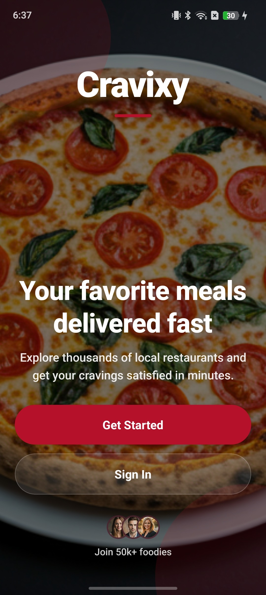
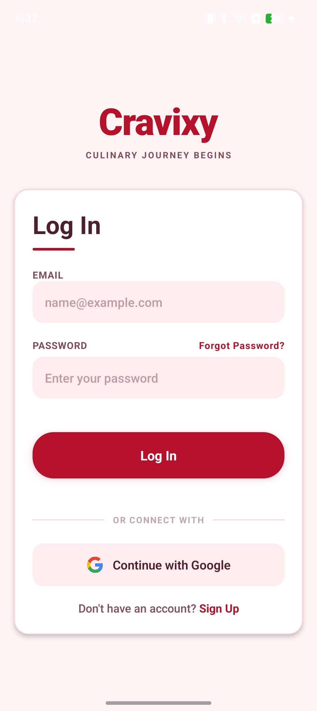
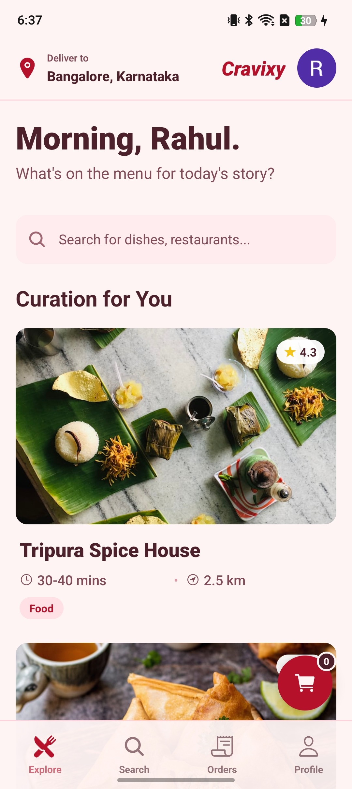
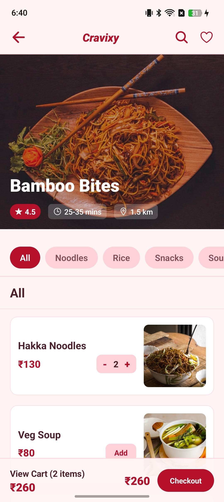
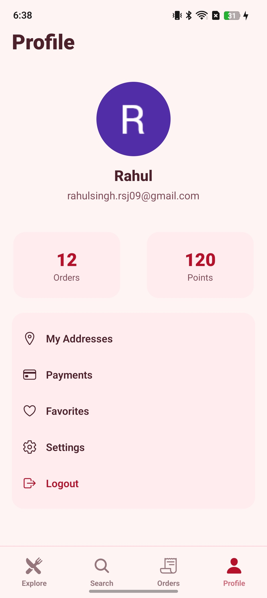

# Cravixy – Food Ordering App

Cravixy is a modern food ordering mobile application built using **React Native** and **Firebase**.
It provides a smooth user experience with authentication, restaurant browsing, order history, and profile management.

---

## Features

*  Firebase Authentication (Login / Signup / Logout)
*  Home screen with restaurant listings
*  Search functionality
*  Orders history screen
*  Profile screen with logout
*  Cart system (AsyncStorage based)
*  Smooth UI inspired by modern food apps (Zomato/Swiggy style)

---

## App Screens

### Landing / Login / Home

### Menu / Profile

---

## Tech Stack

* **React Native**
* **TypeScript**
* **Firebase (Auth + Firestore)**
* **React Navigation**
* **AsyncStorage**
